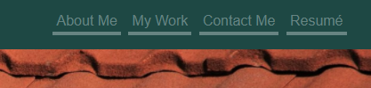
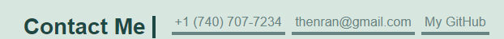

# Portfolio-Launch-Page
## Description
This project aims to create and maintain a live webpage to provide potential employers with access to samples of my work and projects, as well as provide my contact information and background in a clean and professional format utilizing semantic HTML elements for accessibility and CSS styling techniques for a more interactive experience.

## Deployment
To view the deployed and current project: https://accoon.github.io/Portfolio-Launch-Page/

## Usage
Navigation links at the top of the page will scroll you to the relevant section, and Resumé will link to a PDF of current resumé.

Links in the Contact Me section will provide you with quick and ready access to contact methods via phone, email and GitHub.

## Credits
Below is a list citations for images currently being used as placeholders. All images were sourced from https://www.publicdomainpictures.net/ and are under the CC0 Public Domain license.

- "Terracotta Roof Tiles" photo taken by Lynn Greyling